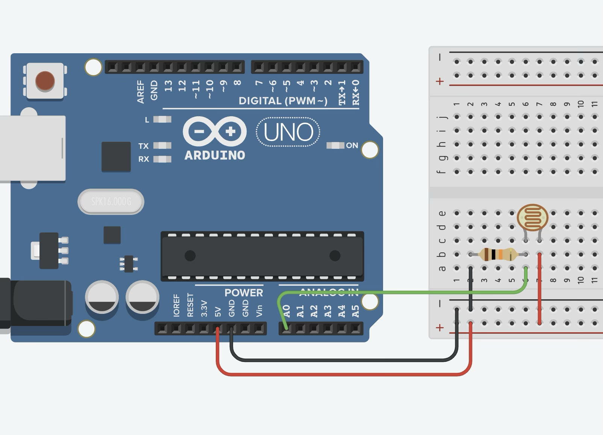

## Light Sensor Example

**[Arduino Code](light_sensor_arduino/light_sensor_arduino.ino)**

**p5.js Sketch**: in the **[p5.js Web Editor](https://editor.p5js.org/gohai/sketches/kIzWqiwLd)** or [locally](light_sensor_p5js)

