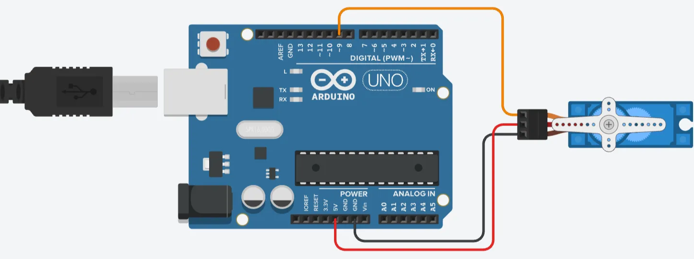
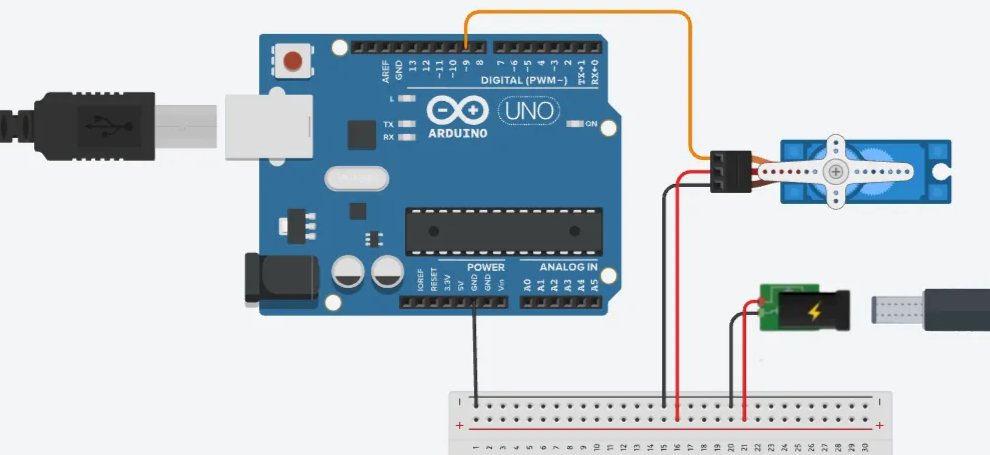

## Servo Motor Example

**[Arduino Code](servo_motor_arduino/servo_motor_arduino.ino)**

**p5.js Sketch**: in the **[p5.js Web Editor](https://editor.p5js.org/gohai/sketches/Zm6WuyokG)** or [locally](servo_motor_p5js)

